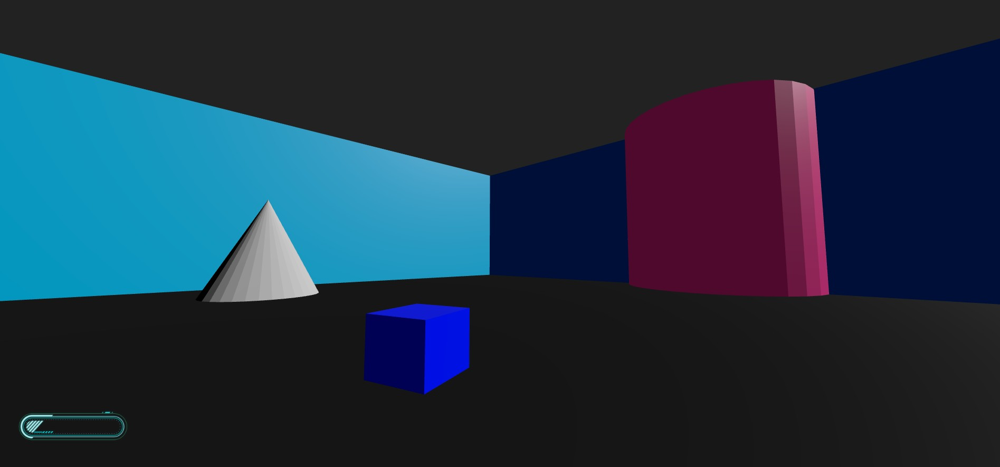

# The Outlands – Experimental in-browser 3D Multiplayer FPS

**The Outlands** is an experimental in-browser 3D FPS built with **Vite** and **Three.js**, with plans for **multiplayer** using **Socket.io** and persistent data with **MySQL**.



---

## Features

- Browser-based first-person movement  
- 3D rendering with Three.js  
- Multiplayer networking via Socket.io  
- Physics with Ammo.js  
- Persistent data using MySQL (future)

---

## Setup Instructions

### 1. Install Node.js
Download and install Node.js from [https://nodejs.org/en/download](https://nodejs.org/en/download).

---

### 2. Clone the repository

```bash
git clone https://github.com/DustinVII/TheOutlandsGame.git
cd TheOutlandsGame
```

---

### 3. Install dependencies

**Frontend:**

```bash
npm install
```

**Server:**

```bash
cd server
npm install
cd ..
```

---

### 4. Configure settings

```bash
cd src
cp config.json.example config.json
nano config.json
```

Adjust only if running on an online server:

```json
{
  "APP_NAME": "The Outlands",
  "SERVER_URL": "localhost",
  "SERVER_PORT": 3000,
  "FRONTEND_PORT": 5173
}
```

> Ensure firewall allows the specified ports.

---

### 5. Run the servers

**Start Node.js server:**

```bash
cd server
node server.js
```

**Start Vite development server:**

```bash
cd ..
npm run dev
```

> Vite will provide a local URL (usually `http://localhost:5173`).  

**For online testing do this instead:**

```bash
npm run dev -- --host 0.0.0.0
```

> This allows access from any IP.

---

## Tech Stack

- **Vite** – fast development environment  
- **Three.js** – 3D rendering  
- **Ammo.js** – physics engine  
- **Socket.io** – multiplayer networking  
- **MySQL** (future) – backend persistence

---

## Planned Features

✔ FPS camera movement  
✔ Basic world rendering  
✔ Multiplayer player syncing  

⏳ Collisions, physics, and gravity  
⏳ Weapons and combat  
⏳ Simple character models  
⏳ Chat or voice indicators  
⏳ MySQL integration  
⏳ Game lobby/room system  

---

## Contributing

Feedback, suggestions and contributions are welcome! If you want to collaborate, contact me — happy to work together to grow the project.